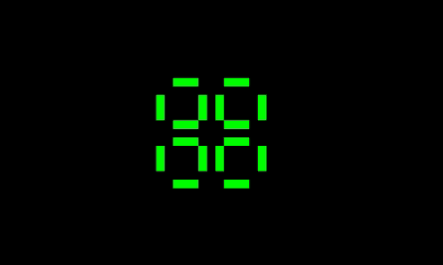

# Conk - Conway's Game of Life

An implementation of [Conway's Game of Life](https://en.wikipedia.org/wiki/Conway's_Game_of_Life).

## Features

Move around and zoom in and out:

Randomize a region:
(gif here)

Slow or fast (runs at 30fps on a map with N cells on my desktop)
(gif here)

Click to add some default interesting patterns, or paste your own:
(gif here)

Load or export a pattern:
(gif here)

You can also use some other interesting outer-totalistic rulesets:
(gif here)

## Design

A naive implementation of Game of Life uses a fixed-size universe of two matrices or lists. At each generation, the matrix (or list) is traversed, the neighbor count is calculated, and the updated cell state is recorded in the second matrix or list.

This has the huge advantage of being very very simple.

The disadvantages:

- it is slow
- it does not support an infinite universe

There are optimizations that make it faster, such as only traversing cells whose neigbors have changed in the previous generation.

A more sophisticated implementation is to use a HashMap of live cells. This supports an infinite universe. Hashing is slow.

A totally different and very sophisticated algorithm is HashLife. This however is not great for "live viewing."

### This design

Tree structure - no hashing.

Very little memory for empty space.

Calculates 32 (64) cells at a time. Uses tiles (4x8) and supertiles of either tiles or supertiles.

Only updates when necessary.

WebGL?

The smallest unit is a tile. A tile is an unsigned 32-bit integer that represents a region of horizontal width 4 and vertical height 8. The most-significant bit is in the upper left. The rows are filled first, followed by the columns.

A chunk can be either a tile or a supertile.

A supertile is a region with 8 child chunks and some metadata about them. The 8 child chunks can either be tiles or supertiles themselves.

These 4 child chunks represent 4 units in a rectangle - upper left, upper right, lower left, lower right. The other 4 child chunks are for the previous generation.

A "stagger step" process is used to optmizes the number of neighbors that need to be updated.

The next generation is computed using 4x4 blocks at a time to lookup the result for the inner 2x2 region.

When a supertiles's 4 child chunks are all dead and the metadata says that they have not been updated, then the supertile is converted into None.